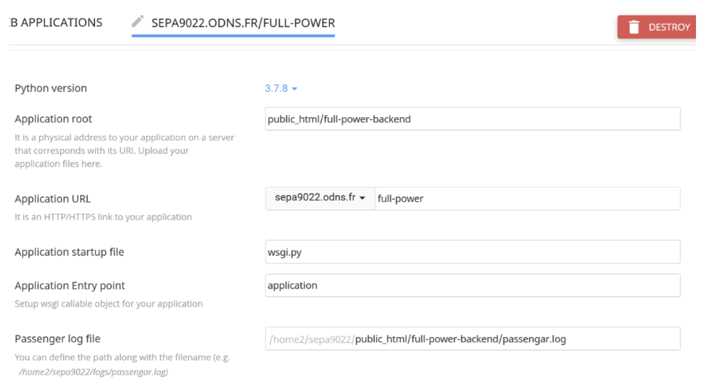

# o2switch deploy

!!! warning
    o2wsitch deployment instructions are not very detailed.

Some special notes for the o2switch deploy of the backend.



Fields:

- **Python version:** version of python to use. Must be at least 3.7 up to 3.8 (recommended 3.7).
- **Application root:** path to the root folder of the application, where the backend was cloned.
- **Application URL:** URL where the backend will be deployed.
- **Application startup file:** name of the python script containing the application. In this case, the application is inside the file `wsgi.py`
- **Application Entry point:** it's the name of the object containing the application inside the *Application startup file*. In this case, the app it's named `application`.
- **Passenger log file:** path of the access log file.

In the [getting started](../first-steps.md) section, it's mentioned a virtual environment. In this case you don't have to create it, as o2switch creates it automatically:


At the top of the page you can see the command you need to execute to activate the virtual enviroment. In this case is:

<div class="termy">

```shell
// First activate the virtual enviroment
$ source /home2/sepa9022/virtualenv/fullpower/dev/3.7/bin/activate

// Then go to the folder created for us
$ cd /home/sepa9022/fullpower/dev
```

</div>

Now you can continue executing the commands described in the [getting started](../first-steps.md#install-external-libraries-required) section.
